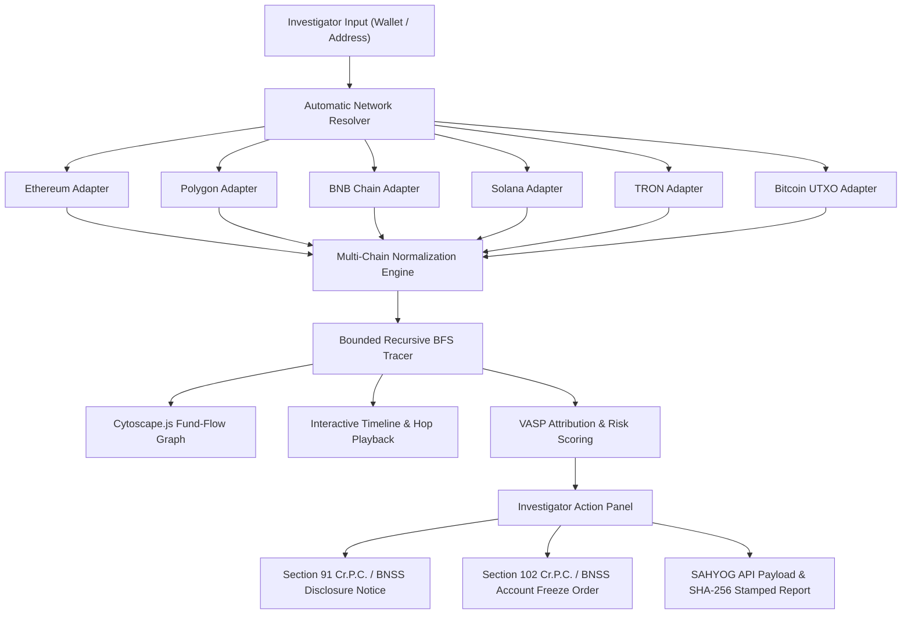

# 🛡️ CHAIN-INTEL

<p align="center">
  <a href="https://chain-intel-jade.vercel.app" target="_blank">
    
  </a>
  
  
  
  
  
  
</p>

> 🌐 **Live Web Application**: [https://chain-intel-jade.vercel.app](https://chain-intel-jade.vercel.app)
> **YouTube Video Link**: [https://youtu.be/6p2G1y1ZrsY?si=oBYsD1XLPW4AkvJM](https://youtu.be/6p2G1y1ZrsY?si=oBYsD1XLPW4AkvJM)

### **Automated Multi-Chain Blockchain Intelligence & VASP Attribution Engine**
> *"Autonomous live multi-chain fund-flow tracing, VASP attribution, and LEA action routing built for law enforcement."*

---

## 📌 Executive Summary & Purpose

**CHAIN-INTEL** is an enterprise-grade blockchain intelligence and forensic workstation engineered for law enforcement agencies, cybercrime investigators, and intelligence analysts under **Smart India Hackathon 2026 (Problem Statement 26182)** for the **Ministry of Home Affairs (I4C / CIS Division)**.

When cryptocurrency fraud or financial cybercrime occurs, investigators face anonymous wallet addresses across multiple blockchain networks. **CHAIN-INTEL** automates end-to-end investigation:

1. **Automatic Network Resolution**: Auto-detects target blockchains (Ethereum, Polygon, BNB Smart Chain, Solana, TRON, Bitcoin) without requiring manual network selection.
2. **Live Multi-Chain RPC Engine**: Queries live blockchain data via secure backend providers (Alchemy, TronGrid, Mempool/Blockchain.info) with server-side API key protection and zero mock data fallbacks in LIVE mode.
3. **Bounded Recursive Tracing**: Executes multi-hop Breadth-First Search (BFS) graph traversal with cycle prevention and duplicate detection.
4. **Nearest Direct-Deposit VASP Attribution**: Isolates exchange deposit wallets, hot wallets, clusters, bridges, and mixers with transparent scoring.
5. **Interactive Visualization**: Interactive Cytoscape.js fund-flow graph, timeline, and hop playback player.
6. **SAHYOG Integration**: Integrates directly with SAHYOG workflows to draft Section 91 Cr.P.C. / BNSS Disclosure Requests and Section 102 Cr.P.C. / BNSS Account Freeze Orders stamped with cryptographic SHA-256 chain-of-custody hashes.

---

## 🏛️ SIH 2026 Problem Statement Alignment

| Attribute | Details |
| :--- | :--- |
| **Problem Statement ID** | **26182** |
| **Organization** | **Ministry of Home Affairs (MHA) — Indian Cyber Crime Coordination Centre (I4C) / CIS Division** |
| **Theme** | **Blockchain & Cybersecurity** |
| **Category** | **Software** |
| **Core Objective** | Multi-chain live tracing, automated network resolution, bounded recursive fund-flow graph analysis, VASP attribution, risk typology detection, and SAHYOG law enforcement action workflow. |

---

## ⚡ Core Capabilities & Architecture

### 1. 🌐 Multi-Chain Intelligence Engine (6 Networks)
Fully audited and validated live tracing across 6 major blockchain ecosystems:
- **Ethereum (ETH)**: ERC-20 & native transfer tracing via Alchemy.
- **Polygon (MATIC)**: Layer-2 bridge and token transfer tracing via Polygon Mainnet RPC.
- **BNB Smart Chain (BSC)**: High-frequency BEP-20 and BNB transfer tracing via zero-dependency RPC block scanner.
- **Solana (SOL)**: High-speed SPL token and account activity tracing via Alchemy Solana Mainnet RPC.
- **TRON (TRX)**: TRC-20 USDT transfer tracing via TronGrid & TronScan APIs.
- **Bitcoin (BTC)**: UTXO flow and multi-input/output transaction tracing via Blockchain.info & Mempool APIs.

### 2. 🔍 Automatic Network Resolution & Address Disambiguation
- **No Manual Chain Selection Required**: Investigators paste a wallet address; the system resolves applicable networks dynamically.
- **Multi-Network Detection**: Identifies cross-chain EVM address collisions (`ethereum:0x...` vs `polygon:0x...` vs `bsc:0x...`) without arbitrary network bias.
- **Settings Independence**: Workstation preferences customize defaults without overriding live chain resolution.

### 3. 🎯 Nearest Direct-Deposit VASP Attribution
Isolates the exact Exchange Deposit Wallet and Exchange Cluster through explainable confidence scores:
- **5 Confidence Tiers**: `CONFIRMED (95%+)`, `HIGHLY LIKELY (>85%)`, `PROBABLE (60-85%)`, `POSSIBLE (30-60%)`, `INSUFFICIENT DATA (<30%)`.
- **Explainable Factor Breakdown**: Base score, hop distance attenuation, direct deposit bonuses, and risk typology adjustments.

### 4. 🕸️ Interactive Cytoscape Graph & Hop Playback
- **Cytoscape.js Engine**: Interactive dagre hierarchical layout with node/edge drawers for detailed inspection.
- **Node Classification Styling**: Distinct visual icons for `EXCHANGE_DEPOSIT_WALLET`, `EXCHANGE_HOT_WALLET`, `EXCHANGE_CLUSTER`, `MIXER_TUMBLER`, `DEFI_BRIDGE`, and `UNHOSTED_WALLET`.
- **Sequential Hop Playback**: Step-by-step playback player with 1x, 2x, 4x speed controls.

### 5. ⚖️ SAHYOG Integration & Legal Notice Routing
- **Section 91 Cr.P.C. / BNSS 2023**: Auto-generated formal Disclosure Request for KYC/AML and bank transaction logs.
- **Section 102 Cr.P.C. / BNSS 2023**: Auto-generated Asset Restraint / Account Freeze Order.
- **SAHYOG Workflow**: One-click request preparation, officer authorization, and JSON payload export.
- **SHA-256 Chain-of-Custody**: Cryptographic integrity stamping for every generated investigation report.

---

## 🏗️ System Architecture



---

## 💻 Tech Stack

- **Frontend**: React 18, Vite, TypeScript, Custom CSS Tokens + Tailwind CSS v4.0
- **Graph & Visuals**: Cytoscape.js, Cytoscape-Dagre, Lucide Icons
- **Backend API Proxy**: Node.js Express server (`server/index.js`) for server-side key protection
- **Blockchain Providers**: Alchemy (ETH/Polygon/Solana), TronGrid (TRON), Blockchain.info/Mempool (Bitcoin), Public BSC RPC
- **Deployment**: Vercel

---

## 🚀 Installation & Local Development

### 1. Clone & Install
```bash
git clone https://github.com/your-org/chain-intel.git
cd chain-intel
npm install
```

### 2. Environment Configuration
Create `.env.local` for server-side keys:
```env
ALCHEMY_API_KEY=your_alchemy_api_key
TRONGRID_API_KEY=your_trongrid_api_key
PORT=3001
```

### 3. Run Dev Server & Backend Proxy
```bash
# Start Vite Frontend
npm run dev

# Start Node Backend Server Proxy
node server/index.js
```

---

## 🎨 Design Philosophy & UX

- **Government Workstation Aesthetic**: Clean light-first interface (`#F8FAFC`), deep navy branding (`#0F172A`), crisp white containers, and high contrast typography (Inter).
- **No Hacker Tropes**: Strictly avoids distracting neon colors, black backgrounds, or dark-mode cyber themes to ensure maximum institutional credibility before law enforcement evaluators.

---

<p align="center">
  <b>Ministry of Home Affairs — I4C / CIS Division • Smart India Hackathon 2026</b><br>
  <i>CHAIN-INTEL Blockchain Intelligence Engine</i>
</p>
